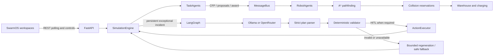

# Warehouse Swarm

## Executive summary

Warehouse Swarm (SwarmOS) is a single-process, in-memory multi-agent warehouse simulation. Forty RobotAgents coordinate 120 tasks through decentralized Contract Net Protocol (CNP) auctions; A* navigation, collision reservations, battery management, and routine recovery remain deterministic. LangGraph calls the selected local Ollama or OpenRouter model only for exceptional incidents. Structured plans pass parsing, deterministic validation, optional human review, and a safe executor/fallback boundary before they can affect the simulation.

The project is an engineering demo and research system. State is in memory, resets create a new run, and hosted deployment does not add authentication or persistence.

## Quickstart

Use Python 3.11. Install dependencies from the repository root:

```powershell
python -m pip install -r requirements.txt
```

Copy `.env.example` to `.env`, then configure one crisis provider. Keep credentials private.

```powershell
Copy-Item .env.example .env
```

```dotenv
LLM_Provider=gemma
ORCHESTRATOR_ENABLED=true
SIMULATION_SEED=42
```

For local Gemma, install Ollama and pull `gemma4:12b` once with `ollama pull gemma4:12b`. Keep the Ollama server running in a separate terminal. For OpenRouter, use `LLM_Provider=openrouter` with a private `OPENROUTER_API_KEY` and explicit `OPENROUTER_MODEL`; see [provider setup](docs/CRISIS_AND_LLM_ORCHESTRATION.md#14-llm-configuration-bug-resolution-notes).

```powershell
ollama serve
```

In another terminal, start the API:

```powershell
python -m uvicorn backend.api:app --app-dir . --reload
```

Open `http://127.0.0.1:8000/OperationCenter`. Other workspaces include `/CrisisOrchestration`, `/AgentAnalytics`, `/SystemOverview`, `/DeveloperCentre`, and `/dashboard`. Detailed Windows commands, environment variables, controls, and API endpoints are in the [deployment guide](docs/DEPLOYMENT_AND_BENCHMARKS.md) and [workspace guide](docs/OPERATIONS_AND_WORKSPACES.md).

### Workspaces

| Route | Purpose |
|---|---|
| `/OperationCenter` | Live warehouse state, fleet movement, charging, incidents, and event tape. |
| `/CrisisOrchestration` | Incident timeline, structured plan, validation, HITL, execution, and fallback. |
| `/AgentAnalytics` | Robot/task inspection and current fleet evidence. |
| `/SystemOverview` | Architecture and safety story for first-time readers. |
| `/DeveloperCentre` | Read-only, run-scoped application console for CNP, robot actions, crises, LangGraph/LLM, validation, HITL, execution, and errors; includes copy-all logs. |
| `/dashboard` | Legacy fleet dashboard. |

### LLM provider selection

Choose one provider in `.env`; settings load at backend startup, so restart Uvicorn after changing it.

| `LLM_Provider` | Model source | Required configuration |
|---|---|---|
| `gemma` | Local Ollama `gemma4:12b` | Ollama running with the model installed. |
| `mistral` | Local Ollama `mistral:latest` | Ollama running with the model installed. |
| `openrouter` | Hosted model selected explicitly | Private `OPENROUTER_API_KEY` and `OPENROUTER_MODEL`; no automatic paid-model substitution. |

The crisis model is called for exceptional incidents only. If inference times out, is unavailable, or returns an invalid plan, the backend records the failure and follows bounded regeneration or deterministic fallback. See the [crisis guide](docs/CRISIS_AND_LLM_ORCHESTRATION.md) for the full state flow and provider diagnostics.

## Source map

| Area | Start here |
|---|---|
| HTTP routes and app setup | `backend/api.py` |
| Simulation lifecycle, run seed, and incident admission | `backend/simulation/engine.py` |
| Robot/task CNP negotiation | `backend/agents/robot.py`, `backend/agents/task.py` |
| Agent message delivery | `backend/agents/message_bus.py` |
| Movement, reservations, charging, warehouse | `backend/simulation/pathfinder.py`, `collision.py`, `charging.py`, `warehouse.py` |
| Crisis graph, provider, plan, safety, execution | `backend/agents/orchestrator_graph.py`, `action_executor.py`, `plan_validator.py`, `llm_client.py`; configuration in `backend/core/llm_config.py` |
| Browser workspaces | `frontend/` templates, `frontend/css/`, `frontend/js/` |
| Regressions and reproducible runs | `tests/`, `backend/evaluation/`, `run_benchmark.py` |

For backend changes, begin with the owning module and its tests. For cross-cutting work, query Code Review Graph first when it is available, then confirm that its snapshot matches the current checkout before trusting impact results.

### Useful verification commands

```powershell
python311\python.exe -m pytest -q
python311\python.exe -m compileall -q backend tests
node --test tests/crisis_orchestration.test.cjs tests/operation_centre.test.cjs
```

The reproducible 40-robot/120-task offline completion run is documented in [Completion Acceptance](docs/DEPLOYMENT_AND_BENCHMARKS.md#20-completion-acceptance-and-earlier-performance-results). It checks genuine delivery evidence and safety invariants; dated performance numbers are evidence for that configuration, not a guarantee across seeds or hosting environments.

## System architecture



Routine work remains deterministic. The LLM is a slow exceptional recovery manager, never a per-tick movement controller. See [architecture and agent behavior](docs/ARCHITECTURE_AND_AGENTS.md) and [crisis orchestration and safety](docs/CRISIS_AND_LLM_ORCHESTRATION.md).

## Documentation hub

| Guide | Use it for |
|---|---|
| [Architecture and Agents](docs/ARCHITECTURE_AND_AGENTS.md) | Multi-agent design, CNP lifecycle and bid formula, MessageBus, models, RobotAgent, warehouse/pathfinding/collision/charging, engine flow, and obstacle-bypass postmortem. |
| [Operations and Workspaces](docs/OPERATIONS_AND_WORKSPACES.md) | FastAPI routes and contracts; Live Operations, Crisis, Agent Analytics, and System Overview UI layout, resizing, palette, polling, and interpretation. |
| [Crisis and LLM Orchestration](docs/CRISIS_AND_LLM_ORCHESTRATION.md) | Ollama/OpenRouter setup, incident kinds and budget, fast/slow scheduling, action schema, validation, shadow prediction, HITL, fallback, observability, and provider diagnostics. |
| [Deployment and Benchmarks](docs/DEPLOYMENT_AND_BENCHMARKS.md) | Setup/run, limitations, tests, evaluation metrics/results, Docker/Render configuration, and dated acceptance/provider evidence. |

## Contributor handoff

Read [`AGENTS.md`](AGENTS.md) before editing. Use Code Review Graph for focused impact analysis when available, but check whether its snapshot matches the current commit; the source and tests define current contracts.

- Keep routine assignment decentralized: `SimulationEngine.step()` ticks TaskAgents before RobotAgents. Do not add a central allocator.
- Preserve `(x, y)` coordinates and `grid[y][x]`; keep A* closed-set, walkability, returned-path, and full remaining-path checks. Preserve physical occupancy and movement/battery safety.
- Preserve CNP ownership and task-release lifecycle, including emergency preemption rules. A defined message enum alone does not imply a production handler.
- Keep crisis inference asynchronous and outside simulation locks. Only an active crisis may hold robots; deduplicate same-pair incidents, bound the queue, and clean holds on every terminal/reset path.
- Never execute an unparsed or invalid plan. Preserve validator, HITL rejection/regeneration, deterministic fallback, and provider diagnostics; never log API keys or hidden reasoning.
- For movement, charging, CNP, or crisis-admission changes, run focused tests and the seeded completion benchmark described in [Deployment and Benchmarks](docs/DEPLOYMENT_AND_BENCHMARKS.md#20-completion-acceptance-and-earlier-performance-results). Record the date, configuration, and actual result.
- Treat browser screenshots and `evaluation_results/` as generated artifacts; regenerate them using documented commands when needed.

## Current verified snapshot

As recorded on 2026-10-08, the configured Nemotron free model returned one schema-valid action over OpenRouter, and a seed-42 offline run delivered 120/120 tasks in 37.844 seconds across 1,768 steps. The full test run recorded 193 Python tests and 25 frontend DOM tests passing. These dated checks are evidence for those configurations, not guarantees for other seeds, machines, providers, or hosting platforms. Details and limitations are in [the evidence record](docs/DEPLOYMENT_AND_BENCHMARKS.md#latest-nemotron-incident-and-acceptance-evidence).

## Documentation maintenance

The root README is the routing hub. Keep detailed contracts in the relevant guide, use relative links between guides, and update dated measurements only when a new run produces verifiable evidence. Keep `.env`, API keys, and authorization headers out of documentation and logs.
